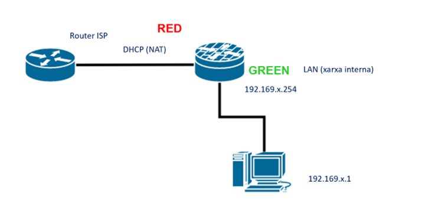
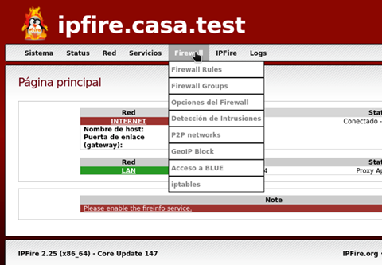
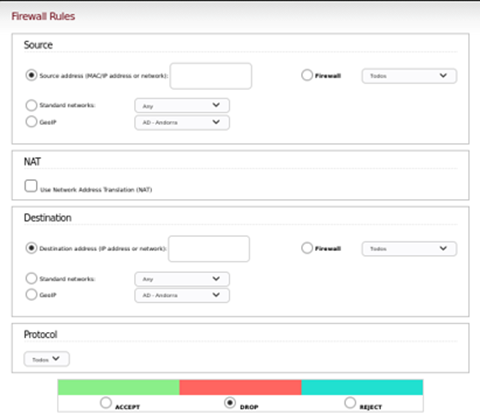
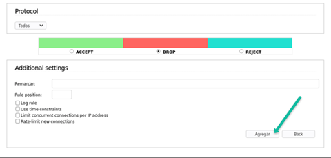
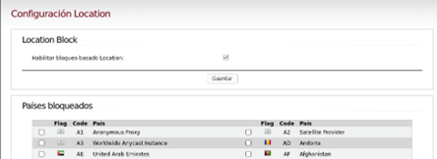
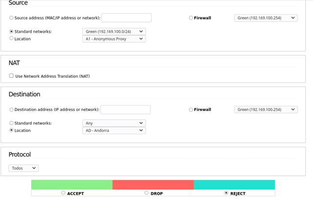
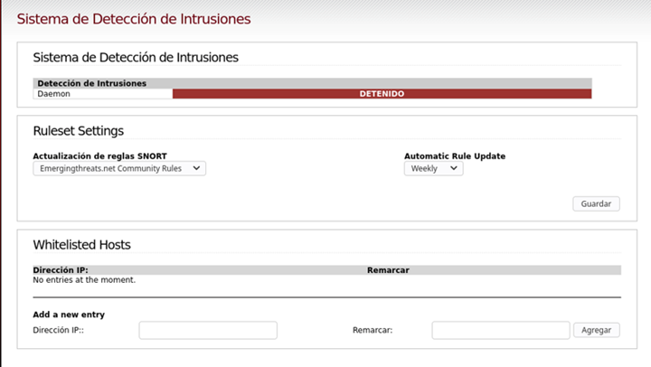

# NF5AA4. Firewall perimetral

## Presentació de l'activitat

### Durada de l'activitat

### Objectius de l'activitat

Configurar un tallafocs perimetral per protegir un entorn de xarxa local (LAN).

### Competències treballades

c) Instal·lar i configurar programari bàsic i d’aplicació, assegurant-ne el funcionament en condicions de qualitat i seguretat.

e) Instal·lar i configurar xarxes locals cablejades, sense fil o mixtes, i la seva connexió a xarxes públiques, assegurant-ne el funcionament en condicions de qualitat i seguretat.

p) Aplicar els protocols i normes de seguretat, qualitat i respecte al medi ambient en les intervencions realitzades.

### Resultats d'aprenentatge i criteris d'avaluació

RA4. Assegura la privadesa de la informació transmesa en xarxes informàtiques descrivint vulnerabilitats i instal·lant programari específic.

4.8 Instal·la i configura un tallafocs en un equip o servidor.

### Continguts

4.6 Tallafocs en equips i servidors.

### Capacitats clau

|             |                         |                    |
|------       |---------                |----------          |
|Autonomia    |Organització del treball |~~Treball en equip~~|
|~~Innovació~~|Resolució de problemes   |Responsabilitat     |
|             |~~Relació interpersonal~~|                    |

## Enunciat de l'activitat

### Entorn de treball

L'escenari implica dues màquines virtuals: una amb IPFire i una altra amb equip client (Windows o Linux Desktop). La màquina amb IPFire actuarà com a tallafocs perimetral, mentre que l'altra màquina farà la funció de client dins la LAN.

### IPFIRE

- Interfície RED: adaptador en NAT i configuració DHCP.
- Interfície GREEN: adaptador en xarxa interna (Internal Network) amb IP fixa 192.169.x.254/24 (on x és el número de llista o assignat a l'alumne).

La instal·lació i configuració d'IPFire es pot realitzar seguint les guies que es citen als a la secció [enllaços d'interès](#enllaços-dinterès), que proporcionen instruccions detallades sobre com fer la instal·lació i configuració inicial.

### Equip client

- Interfície de xarxa: adaptador en xarxa interna (Internal Network) amb IP fixa 192.169.x.1/24 (on x és el número de llista o assignat a l'alumne), porta d'enllaç 192.169.x.254 i DNS operatiu.

Esquemàticament, la configuració de les màquines virtuals és la següent:

Un cop configurat correctament l'escenari arrencar les màquines virtuals, connectar-se a l'IPFire a través del navegador web de l'equip client `https://192.169.x.254:444` i comprovar que a la pàgina principal es mostren les interfícies RED i GREEN amb els estats correctes.

### Instruccions de l'activitat

IPFire té un menú dedicat exclusivament a la configuració del tallafocs, que inclou les opcions de configuració de regles, grups, opcions generals del tallafocs, configuració de l'IPS, gestió específica de bloqueig per IP geogràfiques, etc. Finalment, permet accedir directament a les regles de `iptables`, que cal recordar és el motor de tallafocs.

#### Regles del tallafocs

En aquesta secció es defineixen les regles del tallafocs, la pantalla per crear una regla té el següent aspecte:

En primer lloc es pot definir l'origen del tràfic (Source), que pot ser una IP o MAC específica, una de les xarxes predefinides o standad (RED, GREEN, BLUE o ORANGE), un equip o un grup d'equips, també pot indicar-se un port específic del firewall (això té sentit per filtrat de trànsit que té com a origen el propi IPFIRE)

A NAT es poden definir regles de NAT (Network Address Translation) per a la traducció d'adreces IP i ports. Per defecte, ja n'hi ha una regla de NAT que permet la sortida a Internet des de la xarxa GREEN. Aquesta regla és suficient per a la majoria de casos, però es poden afegir regles addicionals si es necessita traducció d'adreces per a altres xarxes o serveis específics. Així mateix, es poden configurar regles de DNAT per tal de redirigir el tràfic entrant cap a servidors internals, com ara un servidor web o un servidor de correu electrònic.

A continuació es defineix la destinació del tràfic (Destination), que pot ser una IP específica, una xarxa estandard, un equip o un grup d'equips, també pot indicar-se una de les xarxes predefinides (RED, GREEN, BLUE o ORANGE) o el propi firewall. Per tant, a diferència de poder seleccionar una adreça MAC, és igual a la selecció de l'origen.

En tercer lloc es defineix el protocol (Protocol), que pot ser TCP, UDP, ICMP o qualsevol altre protocol disponible. També es poden definir ports específics per al tràfic, ja sigui un port individual o un rang de ports.

Finalment, es defineix l'acció (Action) que es vol aplicar al tràfic que coincideixi amb la regla. Les accions disponibles són ACCEPT (per permetre el tràfic), DROP (per descartar el tràfic sense notificar a l'origen) i REJECT (per descartar el tràfic i notificar a l'origen).

Com a configuracions addicionals, es poden establir opcions com ara la una descripció de la regla (molt útil per a la documentació i el manteniment), la **posició** de la regla en la llista (vital per un correcte funcionament), habilitar el log de la regla i opcions de limitació de peticions concurrents i definir condicions temporals (especificar horari d'aplicació de la regla).

#### Grups del tallafocs

Amb aquesta secció es poden crear grups d'equips, xarxes o ports per tal de simplificar la gestió de les regles del tallafocs. Per exemple, es pot crear un grup amb totes les adreces IP dels servidors interns i utilitzar aquest grup com a destinació en una regla de tallafocs.

#### Restriccions geogràfiques

La secció **Location Block** només serveix per **trànsit d'entrada** i no per a trànsit de sortida. És a dir, pot ser útil per bloquejar l'accés als nostres serveis des de països amb els quals no tenim relació comercial o que són coneguts per ser origen d'atacs, però no serveix per impedir que els nostres usuaris accedeixin a serveis externs. A més dels països, inclou proxy anònims i Internet per satèl·lit.

Si es volen definir bloquejos de sortida, cal fer-ho com a regla específica de firewall, seleccionat a destinatation l'opció `Location` i allà indicar el país o regió d'Internet que es vol bloquejar.

> ❗Els bloquejos geogràfics es basen a serveis, com pot ser Location Block (anteriorment conegut com GeoIP Block), que recopilen les adreces públiques per ubicació. No són serveis 100% fiables i sovint cal afegir manualment regles per incloure xarxes que no estan correctament assignades (per exemple, alguns usuaris de Digi se'ls idenfica incorrectament com ubicats a Romania).

#### IPS (Intrusion Prevention System)

Un sistema de IPS (Intrussion Prevention System) permet inspeccionar els paquets amb profunditat (contingut). Té dues accions bàsiques: generar alertes o bloquejar el trànsit. Suricata és un dels IPS més populars avui dia i és el que porta per defecte IPFire.

A IPFire les regles es poden descarregar de diferents serveis i aplicar-les a discreció. També existeix l'opció de fer regles personalitzades que és força més complexa. Permet definir una llista blanca (Whitelist), és a dir, IPs a les quals no se li aplica la monitorització.

> 💡Els IPS/IDS impliquen un consum de recursos (CPU/RAM important) a més de produir una major latència al trànsit.

### Documentació i Informe Final

Elaborar un document amb les configuracions realitzades, mostrant les captures de pantalla de les regles del tallafocs, les proves de funcionament i qualsevol incidència trobada durant l'activitat.

**Especificació del firewall:**

- La xarxa LAN (GREEN) només accepta connexions entrants de resposta o relacionades.
- No es permet trànsit FTP de sortida de la LAN, excepte cap el servidor ftp.rediris.es.
- Bloquejar la connexió cap una adreça d’Internet en concret que sigui HTTPS (indiqueu quina es tria).
- Bloquejar per adreça MAC al client. Observar que no té connexió, canviar la MAC del client i comprovar com de nou té accés a l’exterior.
- Bloquejar connexions amb destinació a un país concret, per exemple, Andorra.
- Incoporar un parell de regles addicionals que considereu interessants i que no estiguin incloses en les anteriors. Justificar la seva necessitat i comproveu el seu funcionament.

Activitat **extra** 🏆 per si acabeu abans: habilitar el servei de IPS/IDS, investigar el seu funcionament, aplicar alguna regla (indicar claramnet quina és la seva finalitat) i comprovar el seu efecte sobre el trànsit de la LAN tant en mode alerta com en mode bloqueig.

## Enllaços d'interès

- [IPFire Documentation - Installation on VirtualBox ](https://www.ipfire.org/docs/installation/virtual-box)

- [J.L. Escobar - Instalación IPFIRE y DEBIAN (YouTube)](https://www.youtube.com/watch?v=rtsvPfJFzOs)

- [WaytoIT - IPFire: Instalación y configuración](https://waytoit.wordpress.com/2014/12/23/ipfire-instalacion-y-configuracion/)

- [IPFire Documentation - Firewall Configuration](https://www.ipfire.org/docs/configuration/firewall)
